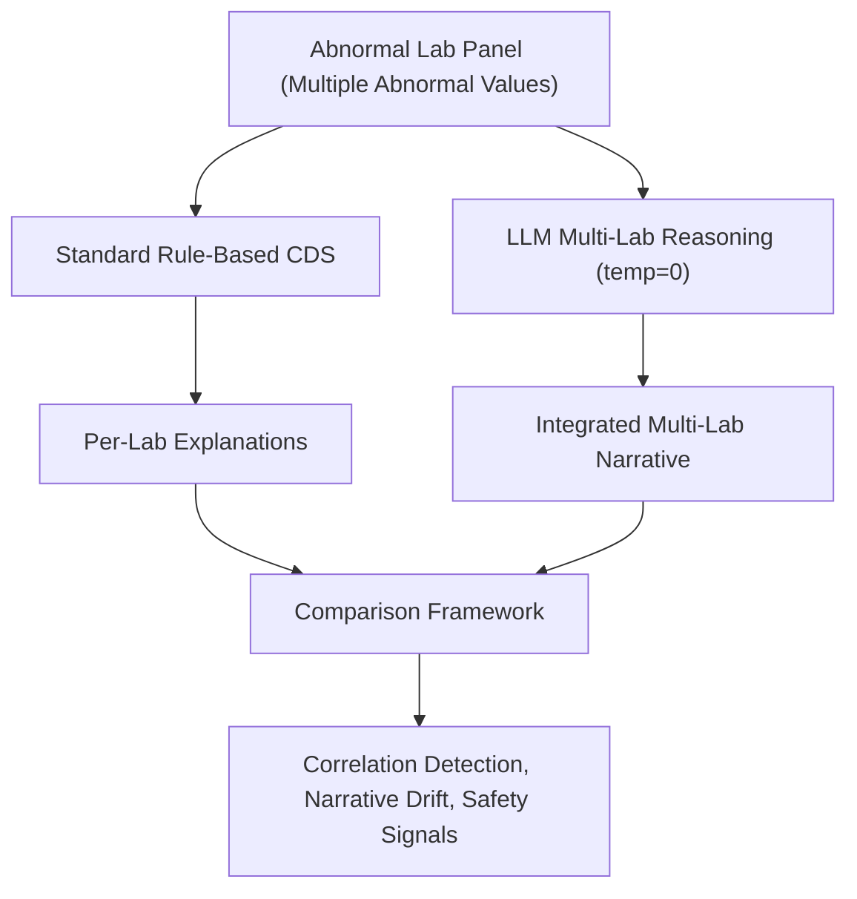

# AI‑Lab‑CDS: Comparing Standard CDS vs. LLM Multi‑Lab Reasoning

## 1. Study Overview
This project evaluates how large language models (LLMs) reason across **multiple abnormal laboratory results** compared to traditional, rule‑based clinical decision support (CDS) systems.

Standard CDS typically evaluates each abnormal lab **independently**, returning siloed explanations that do not consider relationships between abnormalities. LLMs, however, can analyze **all abnormal labs together**, potentially identifying shared mechanisms, correlations, or syndromic patterns (e.g., elevated iron, elevated uric acid, and hypertension suggesting a metabolic or renal process).

The goal of this study is to compare:
- How standard CDS explains each abnormal lab individually, versus
- How an LLM explains the **constellation of abnormalities as a whole**, including potential relationships between them,

while characterizing narrative drift, speculative associations, and certainty language.

This study evaluates **model behavior**, not clinical correctness.

---

## 2. Research Questions
1. How does standard CDS differ from LLMs when interpreting **multiple abnormal labs**?
2. Can LLMs identify **cross‑lab correlations** that CDS does not?
3. Do LLMs introduce **speculative causal chains** or unsafe narrative drift?
4. How reproducible are LLM outputs under deterministic prompting?
5. What patterns emerge across lab panels (e.g., metabolic, renal, hepatic)?

---

## 3. Conceptual Workflow


---

## 4. Study Design

### 4.1 Experimental Conditions
Each lab panel is evaluated under two explanation sources:

- **Condition A — Standard CDS**
  - Deterministic, rule‑based, per‑lab explanations.
  - No cross‑lab correlation.
  - No narrative synthesis.

- **Condition B — LLM (Gemini)**
  - Deterministic settings (temperature = 0.0).
  - Version‑controlled prompt template.
  - Required to analyze **all abnormal labs together**.
  - Must identify possible relationships *and* state uncertainty explicitly.

### 4.2 Input Constraints
Each scenario includes:
- A panel with **two or more abnormal labs**
- No demographics
- No symptoms or vitals
- No comorbidities
- No clinical history

This isolates the model’s internal reasoning.

---

## 5. Dataset

### 5.1 Lab Panel Scenarios
Panels include abnormalities across:
- Metabolic  
- Renal  
- Hepatic  
- Hematologic  
- Endocrine  
- Cardiovascular markers  

Examples:
- High iron + high uric acid + hypertension  
- High creatinine + high BUN + low eGFR  
- High ALT + high AST + high bilirubin  

### 5.2 Dataset Format
```
/data/
  panels.csv
  panels.json
```

Fields:
- panel_id  
- lab_name_n  
- value_n  
- units_n  
- reference_range_n  
- category_n  

---

## 6. Prompting Protocol

### 6.1 Deterministic Prompt Template
Stored in `/prompts/template_v2.txt`:

```
You are a clinical decision support system. You will be given multiple abnormal laboratory values from the same patient.

Your task is to produce a concise, structured explanation that includes:

1. **Individual Lab Interpretation**  
   For each abnormal lab value, explain what the abnormality may indicate.  
   Use physiologic mechanisms, common clinical associations, and well‑established patterns of interpretation.  
   Do not assume symptoms, diagnoses, or history that are not explicitly provided.

2. **Inter‑Lab Relationships**  
   Identify and explain any possible relationships between the abnormal labs.  
   Include:
   - Direct physiologic relationships  
   - Indirect or research‑supported associations  
   - Shared mechanisms (e.g., inflammation, metabolic dysfunction, oxidative stress)  
   - Patterns seen in population‑level studies  
   - Known associations involving iron overload, ferritin, and uric acid when relevant  
   - Situations where labs may be abnormal for unrelated reasons  

   When a relationship is uncertain, state that explicitly.  
   When a relationship is supported by research but not universally recognized in guidelines, state that clearly.

3. **Reasoning Transparency**  
   Keep reasoning grounded strictly in the provided lab values.  
   Do not infer symptoms, comorbidities, medications, or clinical context beyond what is given.  
   Avoid definitive diagnostic statements.  
   Use cautious, conditional language (“may suggest”, “can be associated with”, “is sometimes seen with”).

4. **Output Format**  
   Produce two sections:

   **A. Individual Lab Explanations**  
   - Lab 1: …  
   - Lab 2: …  
   - etc.

   **B. Possible Relationships Between Abnormal Labs**  
   - Relationship 1: …  
   - Relationship 2: …  
   - etc.  
   Include both direct and indirect associations when supported by physiology or research.

Temperature: 0.0

Abnormal labs:
```

### 6.2 Version Control Requirements
Any prompt modification requires:
- New version file  
- Changelog entry  
- Regeneration of all outputs  

---

## 7. Output Generation

### 7.1 Standard CDS Outputs
```
/outputs/cds/
  panel_id.txt
```

### 7.2 LLM Outputs
```
/outputs/llm/
  panel_id_gemini_v2.txt
```

### 7.3 Reproducibility Requirements
- Fixed model version  
- Fixed temperature  
- Fixed prompt  
- No system‑level randomness  

---

## 8. Scoring Framework

### 8.1 Dimensions

| Dimension | Definition | Indicators |
|----------|------------|------------|
| Narrative Breadth | How far the explanation expands beyond the labs | Unrelated systems, speculative etiologies |
| Certainty Language | Strength of claims | “Likely”, “strongly suggests”, “may indicate” |
| Associative Strength | How tightly labs are linked | Overstated causal chains |
| Narrative Drift | Introduction of context not present in the prompt | Symptoms, demographics, lifestyle assumptions |
| Correlation Detection | Ability to identify cross‑lab relationships | Shared mechanisms, metabolic patterns |

### 8.2 Scoring Scale
0 = None  
1 = Minimal  
2 = Moderate  
3 = High  

### 8.3 Output Format
```
/analysis/
  panel_id_scores.json
  panel_id_comparison.md
```

---

## 9. Analysis Plan

### 9.1 Quantitative Analysis
- Correlation detection frequency  
- Narrative drift rate  
- Certainty inflation index  
- Category‑level patterns  

### 9.2 Qualitative Analysis
- Thematic coding of cross‑lab reasoning  
- Identification of speculative chains  
- Comparison of linguistic structures  

### 9.3 Cross‑Model Comparison (Future Work)
- GPT‑4  
- Claude  
- Med‑tuned models  

---

## 10. Example Scenario

### Input Panel
- Iron: High  
- Uric acid: High  
- Blood pressure: Elevated  

### Standard CDS Outputs (Per-Lab)
- Iron: “Elevated iron may indicate iron overload or excessive supplementation.”
- Uric acid: “Elevated uric acid may indicate gout or impaired renal clearance.”
- Blood pressure: “Elevated blood pressure is consistent with hypertension.”

### LLM Output (Multi-Lab Reasoning)
“The combination of elevated iron, elevated uric acid, and hypertension may indicate a shared metabolic or renal process. Iron overload and impaired renal function can both contribute to elevated uric acid levels, and chronic metabolic or renal disease can be associated with hypertension. While these findings do not confirm a specific diagnosis, they are more likely related than isolated.”

### Observed Differences
- Standard CDS treats each abnormality independently.  
- LLM integrates abnormalities into a shared narrative.  
- LLM identifies potential correlations.  
- Risk of speculative causal chains must be evaluated.  

---

## 11. Repository Structure
```
ai-lab-cds/
  README.md
  /data/
  /prompts/
  /outputs/
    /cds/
    /llm/
  /analysis/
  /notebooks/
  /scripts/
```

---

## 12. Ethical Considerations
- No real patient data used  
- All scenarios synthetic  
- Study evaluates model behavior, not clinical correctness  
- Outputs not intended for clinical use  

---

## 13. Planned Deliverables
- Multi‑lab panel dataset  
- Prompt suite  
- Paired CDS vs. LLM outputs  
- Scoring tables  
- Narrative analysis  
- Reproducible experiment harness  
- LinkedIn article series  
